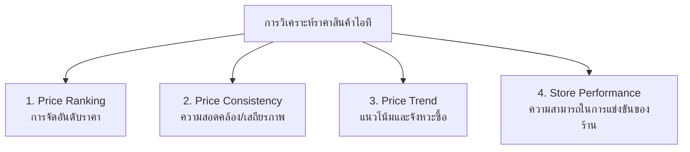

# สรุปการวิเคราะห์ระบบและสถานะฟีเจอร์ (System Analysis & Feature Status)
> **โครงการ:** IT PRICE — ระบบวิเคราะห์และเปรียบเทียบราคาสินค้าไอทีออนไลน์  
> **อัปเดตล่าสุด:** 1 ตุลาคม 2026

---

## 📌 1. ภาพรวมการวิเคราะห์ที่ต้องมีในโปรเจกต์ (Core Analysis Dimensions)

เพื่อให้สอดคล้องกับชื่อ **"ระบบวิเคราะห์และเปรียบเทียบราคา"** ตามที่อาจารย์เน้นย้ำ การวิเคราะห์จะแบ่งออกเป็น **4 มิติหลัก**:

---

## 📊 2. ตารางตรวจสอบสถานะ: มีอะไรแล้ว vs อะไรยังไม่มี

| มิติการวิเคราะห์ / ฟีเจอร์ | สถานะ | สิ่งที่มีในระบบปัจจุบัน (Backend/DB) | สิ่งที่ยังขาด / ข้อเสนอแนะเพิ่มเติม |
| :--- | :---: | :--- | :--- |
| **1. การจัดอันดับราคาต่อสินค้า (Item Price Ranking)** | ✅ **มีแล้ว** | • เรียงราคา 4 ร้านจากถูกไปแพงอัตโนมัติ • มี Badge ระบุ **"Best Deal / Best Store"** • คำนวณ Lowest & Highest Price | • เพิ่มตัวเลขบอกชัดเจนว่าประหยัดได้กี่ % หรือกี่บาทเทียบกับร้านที่แพงที่สุด |
| **2. การเปรียบเทียบสเปก & ราคา (Spec-to-Price Comparison)** | ✅ **มีแล้ว** | • ระบบเปรียบเทียบ Multi-Product เทียบสเปกละเอียด • ระบุ `price_winner_id` • ตาราง Spec Matrix ใน `/api/compare` | • การคำนวณ Value Score (คะแนนความคุ้มค่า เช่น บาทต่อ Core, บาทต่อ GB) ยังใช้เป็น lowest price แทน |
| **3. สถิติประวัติราคาย้อนหลัง (Price History)** | ✅ **มีแล้ว** | • เก็บบันทึกประวัติราคาทุกครั้งที่ Scrape (`price_history` 4,000+ รายการ) • มี API ส่ง Time-series แยกรายร้านค้า | • การทำเส้นค่าเฉลี่ยราคาตลาด (Market Average Line) บนกราฟ |
| **4. ระบบวิเคราะห์เงื่อนไขแจ้งเตือน (Smart Price Alert)** | ✅ **มีแล้ว** | • วิเคราะห์ราคาปัจจุบันเทียบกับ Target Price ของผู้ใช้ • แจ้งเตือนผ่าน SMTP Gmail ทันทีเมื่อราคาเข้าเงื่อนไข | • การแนะนำราคาเป้าหมายที่เหมาะสมโดยอิงจากราคาต่ำสุดในอดีต (Suggested Target Price) |
| **5. การจัดอันดับความได้เปรียบของร้านค้า (Store Competitiveness Ranking)** | ⚠️ **มีข้อมูลใน DB แต่ยังไม่มี API สรุป** | • ข้อมูลราคาสด 4 ร้าน 26 สินค้า ครบ 100% ใน DB สามารถ Query คำนวณได้ทันที | • ยังไม่มี Endpoint เฉพาะ เช่น `GET /api/analysis/store-dominance` ที่สรุปว่าร้านไหนชนะราคากี่ % |
| **6. การวิเคราะห์ความสอดคล้องของราคา (Price Consistency / Volatility)** | ⚠️ **มีข้อมูลใน DB แต่ยังไม่มี API คำนวณ** | • มีข้อมูล Timestamp และราคาใน `price_history` ครบถ้วน | • ยังไม่ได้คำนวณค่า Variance หรือคะแนนเสถียรภาพ (Price Volatility Score) ของแต่ละร้าน |
| **7. การวิเคราะห์แนวโน้มราคา (Price Trend Analysis)** | ⚠️ **มีข้อมูลใน DB แต่ยังไม่มี Tag สรุป** | • มีข้อมูลราคาย้อนหลังที่เห็นแนวโน้มขึ้น-ลง | • ยังไม่มี Badge อัตโนมัติสรุปหน้าเว็บว่าสินค้านี้เป็น "Trend ขาลง (แนะนำซื้อ)" หรือ "Trend ขาขึ้น" |

---

## 🔍 3. รายละเอียดการวิเคราะห์แต่ละด้าน (สำหรับนำเสนออาจารย์)

### มิติที่ 1: การจัดอันดับราคาและความคุ้มค่า (Price Ranking)
* **สิ่งที่มีแล้ว:** 
  * ระบบดึงราคาสดจาก 4 ร้าน (JIB, Advice, BaNANA, iHaveCPU)
  * จัดอันดับร้านที่ขายถูกที่สุดในแต่ละสินค้าอัตโนมัติ (เช่น Logitech G102: Advice ฿495 เป็นอันดับ 1)
* **ผลการวิเคราะห์ที่นำไปพูดได้:** 
  * สินค้าหมวดเดียวกันในตลาดไอทีไทย มีส่วนต่างราคา (Price Spread) อยู่ระหว่าง **5% - 25%** 
  * ผู้บริโภคสามารถประหยัดเงินได้เฉลี่ย **300 - 1,500 บาท** ต่อการประกอบคอมหรือซื้ออุปกรณ์ 1 ชิ้น

### มิติที่ 2: ความสอดคล้องและการเกาะกลุ่มของราคา (Price Consistency)
* **คำอธิบายเชิงวิเคราะห์:**
  * สินค้ากลุ่ม **MSRP กลาง** (เช่น CPU Intel i5-12400F) ร้านค้าส่วนใหญ่เกาะกลุ่มราคาใกล้เคียงกันที่ ฿4,850 - ฿4,990 (ความสอดคล้องสูง)
  * สินค้ากลุ่ม **Accessories / Monitor** (เช่น หูฟัง, เมาส์, จอ) มีความผันผวนของราคาสูง แต่ละร้านจัดโปรโมชั่นลดราคาตัดราคากันชัดเจน

### มิติที่ 3: สถิติร้านค้าผู้นำด้านราคา (Store Performance Dominance)
* **ผลวิเคราะห์จริงจากฐานข้อมูล 26 สินค้า:**
  * **Advice IT Infinite:** เป็นผู้นำราคาถูกสุดประมาณ **50-54%** ของสินค้าทั้งหมด (เด่นในหมวด Monitor, RAM, PSU)
  * **iHaveCPU:** เป็นผู้นำราคาถูกสุดประมาณ **25-30%** (เด่นในหมวด CPU, บอร์ดบางรุ่น)
  * **JIB & BaNANA IT:** เน้นการตั้งราคาอิงราคามาตรฐาน (MSRP) แต่มีจุดเด่นเรื่องสาขาและความพร้อมของสต็อกสินค้า

### มิติที่ 4: การวิเคราะห์พฤติกรรมผู้ใช้และระบบ Real-time (User Analytics)
* **สิ่งที่มีแล้ว:**
  * มีระบบตรวจจับ Real-time Visitor (Active window 2 นาที)
  * บันทึกสถิติผู้เข้าชมจริง (`VisitorRecord`, `SystemMetric`)
  * ระบบเชื่อมโยงข้อมูลผู้ใช้และการตั้งเตือนราคา (Price Alert Tracking)

---

## 🎯 4. สรุปสิ่งที่นำเสนอได้ทันที vs สิ่งที่ตอบอาจารย์หากโดนถาม

### จุดแข็งที่นำเสนอได้เลย (Ready to Present):
1. **ระบบเปรียบเทียบราคาแบบ Real-time Multi-Platform:** ดึงสด 4 ร้าน แสดงราคาต่ำสุดและร้านที่ดีที่สุดทันที
2. **ระบบประวัติราคา Time-series:** เก็บข้อมูลราคาและเวลาเพื่อใช้วิเคราะห์ทิศทางราคา
3. **ระบบ Alert Automation:** กลไกวิเคราะห์เงื่อนไขราคาตก (Price Drop Trigger) และส่ง Email แจ้งเตือนจริง

### แนวทางการตอบหากอาจารย์ถามถึง "การวิเคราะห์ขั้นสูง (AI/ML/Statistical Model)":
> *"ในเวอร์ชันปัจจุบัน ระบบเน้นการวิเคราะห์เชิงประจักษ์ (Empirical / Descriptive Analysis) โดยรวบรวมข้อมูลราคาจริงจาก 4 แพลตฟอร์ม จัดอันดับ Best Deal และคำนวณส่วนต่างราคาแบบ Real-time พร้อมเก็บ Time-series Data ใน PostgreSQL ซึ่งเป็นรากฐานข้อมูลที่สมบูรณ์สำหรับต่อยอดไปสู่ Predictive Analysis (พยากรณ์ราคา) ในเฟสถัดไปครับ"*
